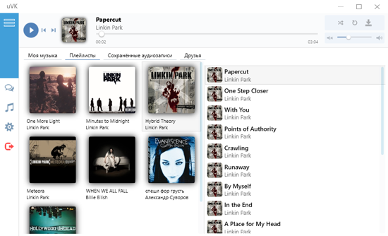
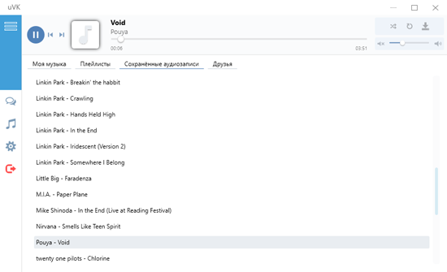
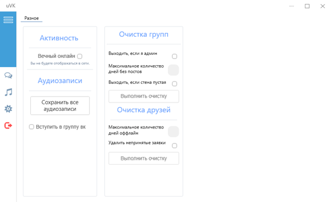

# uVK
uVK - неофициальный музыкальный плеер для социальной сети ВКонтакте. Слушай свои любимые треки где угодно, не заходя при этом в браузер! Наслаждайся как своими треками и плейлистами, так и своих друзей!  
Надоело то, что у тебя десятки групп, на которые давно забили? Либо собачки в списках друзей?Теперь ты можешь почистить свои списки от "мертвых" подписок! 

Получи доступ ко всем своим трекам!
 

Слушай как треки из своих аудиозаписей, так и из плейлистов!
 

Узнавай, что нового у друзей!
 

Сохраняй свои любимые треки и слушай их когда угодно!
 

Очисти неактив из списков своих групп и друзей!
 

<h3><a href="https://www.microsoft.com/ru-RU/download/details.aspx?id=17851">Для функционирования приложения требуется .NET Framework</a></h3>

<h3> Подробнее о версиях и обновлениях <a href="https://github.com/h10ne/uVK/releases">здесь</a> </h3>

Всегда последняя версия <a href="https://yadi.sk/d/FgqipHsfvga4Yg">тут</a>

<h3><li><a href="https://github.com/h10ne">Разработчик логики</a></li></h3>
<h3><li><a href="https://github.com/dr0b99">Разработчик дизайна</a></li></h3>
